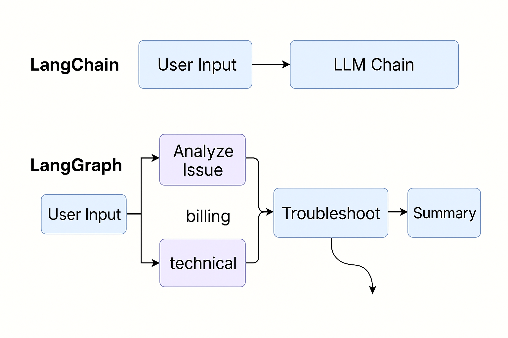

Absolutely! Let’s break down **LangGraph** in simple terms — with what it is, why it’s useful, what components it offers, and how you’d use it in a real-life example.

---

## 🚀 What is LangGraph?

**LangGraph** is a framework (built on top of LangChain) that helps you create **stateful, multi-step LLM applications** using a  **graph-based architecture** .

Think of it like:

> 🧠 “LangGraph = a flowchart of LLM reasoning steps that can talk to tools, remember things, and make decisions — like a brain with logic.”

---

## ❓ Why Do We Need LangGraph?

LangChain is great for *simple* pipelines (load data → ask LLM). But what if you need:

* 🧭 Decision trees ("If the user's question is about X, then do Y")
* 🔁 Loops ("Keep asking follow-up questions until you're sure")
* 🔄 Memory and context persistence
* 🤖 Multi-agent conversations (e.g. Assistant, Researcher, Coder)
* ⚙️ Complex workflows where one tool triggers another

👉 **LangGraph** gives you a **graph of steps** with **state tracking** — perfect for this kind of intelligent reasoning.

---

## 🧩 Core Components of LangGraph

| Component        | Description                                                               |
| ---------------- | ------------------------------------------------------------------------- |
| **Nodes**  | Each step in your logic — e.g., call an LLM, use a tool, check something |
| **Edges**  | How steps connect — you define the path between nodes                    |
| **State**  | Memory that passes between steps (chat history, variables, results)       |
| **Graph**  | The full flow: a network of logic steps that you define                   |
| **Cycles** | You can loop back to earlier steps (e.g., re-ask a question)              |

---

## 💡 Real-Life Example: Smart Customer Support Agent

### Scenario:

You're building an AI agent that helps users troubleshoot a product.

### Tasks:

1. Greet the user
2. Understand their issue
3. If the issue is billing → connect to billing API
4. If the issue is technical → ask questions, run diagnostics
5. Summarize the resolution

---

### 👇 LangGraph Flow (Simplified)

```text
[Start] ──► [Understand Issue]
              ├── if "billing" ─► [Call Billing API]
              ├── if "technical" ─► [Ask more Qs] ─► [Run Tool] ──┐
              └──────────────────────────────────────────────────┘
                            ↓
                       [Summarize]
                            ↓
                         [Finish]
```

---

### ✅ Benefits of Using LangGraph Here

| Feature        | Why It's Useful                                           |
| -------------- | --------------------------------------------------------- |
| 🔄 Loops       | Re-ask clarifying questions                               |
| 🧠 State       | Keeps track of previous answers                           |
| 🤖 Tools       | Integrate external APIs (e.g., billing system)            |
| 🧱 Modular     | Each step is a reusable function                          |
| 👥 Multi-agent | You can have multiple "roles" (e.g., assistant, engineer) |

---

## 📌 TL;DR Summary

| Topic     | LangGraph                                                                    |
| --------- | ---------------------------------------------------------------------------- |
| What      | A graph-based framework for LLM workflows                                    |
| Why       | To build intelligent, multi-step, memory-aware agents                        |
| Key Parts | Nodes, edges, state, loops                                                   |
| Real Use  | Customer support agents, chat assistants, multi-agent teams, research chains |

---

Would you like a **visual diagram** of a LangGraph flow for this real-life customer support use case?


Absolutely! Let's go deeper into **LangGraph** — how it works, why it's powerful, and how you can use it with real-world examples.

---

## 🧠 What is LangGraph (Detailed View)?

**LangGraph** is a **framework for building stateful, multi-step, decision-driven applications** using LLMs (like GPT-4). It's built on top of LangChain, and it lets you design your app like a  **flowchart (graph)** , where:

* Each **node** is a step (e.g., call an LLM, use a tool, ask a question).
* The **edges** define the flow from one node to another.
* A **state** is passed between steps, storing memory and results.

It uses concepts from **state machines** and  **graph theory** , but you write it all in Python in a very intuitive way.

---

## ⚒️ Why Use LangGraph?

LangChain is great for:

* Simple chains: Ask question → Get answer.

But when you want to build:

* Multi-turn assistants,
* Multi-agent workflows,
* Conditional logic (if/else),
* Loops and retries,
* Real-time tool use (APIs, DBs),
* Stateful interaction (memory, chat history),

👉 Then LangGraph is what you need.

---

## 🧱 Core Concepts of LangGraph

| Concept               | Description                                                          |
| --------------------- | -------------------------------------------------------------------- |
| **Node**        | A step in the process (e.g., call LLM, fetch API, make decision)     |
| **Edge**        | A connection between two nodes (defines logic flow)                  |
| **State**       | Memory passed between nodes (chat history, answers, results)         |
| **Graph**       | A full program made of nodes + edges                                 |
| **Cycles**      | You can loop back to previous steps — ideal for iterative reasoning |
| **Multi-agent** | Each node can represent a different persona or skillset              |

---

## 📦 Example Use Case 1: **AI Customer Support Agent**

Imagine you're building an LLM-powered support agent that:

1. Welcomes the user.
2. Detects their intent.
3. Depending on the issue:
   * Billing → call billing API.
   * Technical → gather device info → suggest fixes.
4. Summarizes the conversation.

### LangGraph Flow:

```text
[Start]
   ↓
[Detect Intent]
   ├── if billing ─► [Billing API]
   └── if technical ─► [Ask Follow-Up] ─► [Suggest Fix]
                                      ↺ (loop if not resolved)
   ↓
[Summarize & End]
```

### Code Skeleton (Simplified):

```python
from langgraph.graph import StateGraph, END
from langgraph.prebuilt import chat_agent_executor
from langchain.chat_models import ChatOpenAI

# Define how state is updated
class SupportState(dict):
    pass

def detect_intent(state):
    # use LLM to detect if it's billing or technical
    return "billing" if "invoice" in state["user_message"] else "technical"

def billing_api_node(state):
    # dummy billing resolution
    state["solution"] = "Billing resolved. A refund was issued."
    return state

def ask_followup(state):
    # LLM asks more questions
    state["followup"] = "What device are you using?"
    return state

def suggest_fix(state):
    # Suggest a fix based on answer
    state["solution"] = "Try restarting your router."
    return state

# Create graph
graph = StateGraph(SupportState)
graph.add_node("detect_intent", detect_intent)
graph.add_node("billing", billing_api_node)
graph.add_node("ask_followup", ask_followup)
graph.add_node("suggest_fix", suggest_fix)

# Define edges (flows)
graph.set_entry_point("detect_intent")
graph.add_conditional_edges("detect_intent", lambda state: detect_intent(state), {
    "billing": "billing",
    "technical": "ask_followup"
})
graph.add_edge("ask_followup", "suggest_fix")
graph.add_edge("suggest_fix", END)
graph.add_edge("billing", END)

# Compile graph
app = graph.compile()

# Run it
result = app.invoke({"user_message": "I was wrongly charged on my invoice."})
print(result["solution"])  # -> Billing resolved...
```

---

## 🧠 Example Use Case 2: Multi-Agent Research Assistant

A multi-agent system where:

* **Research Agent** searches facts,
* **Critic Agent** checks logic,
* **Writer Agent** summarizes findings.

### Flow:

```text
[Start]
 → [Research Agent]
 → [Critic Agent]
 → [Writer Agent]
 → [END]
```

Each agent is a node that runs its own LLM with memory.

---

## 🔁 Stateful Conversations & Loops

LangGraph supports **looping** — for example, an agent keeps asking clarification questions until it has enough info.

```text
[Ask Clarifying Question]
        ↺ (loop if user unclear)
```

You just define that edge back to the same node.

---

## 🧩 Integration with LangChain Tools

You can plug in:

* LangChain agents,
* Toolkits (Python, search, API tools),
* Memory objects,
* Prompt templates.

LangGraph just wraps them into **modular nodes** with logic.

---

## 👨‍⚕️ Real-Life Example: Doctor's Assistant

LangGraph nodes:

1. Intake symptoms → LLM
2. If critical → emergency advice
3. Else → ask clarifying questions (loop)
4. Suggest common conditions
5. Offer next steps (see doctor, rest, etc.)

---

## 🧠 Summary

| Feature              | LangGraph Advantage     |
| -------------------- | ----------------------- |
| Multi-step logic     | ✅ Graph of steps       |
| Conditional branches | ✅ if/else with state   |
| Tool calling         | ✅ Integrated           |
| Memory               | ✅ Passed through state |
| Multi-agent          | ✅ Each node = agent    |
| Complex workflows    | ✅ Easily modelled      |
| LangChain-compatible | ✅ Full integration     |

---

## ✅ TL;DR

* **LangGraph** is like a brain map for LLM workflows.
* It gives you tools to  **build smart, modular, stateful apps** .
* Perfect for  **assistants, agents, customer service, research, debugging** , and more.

---

Would you like:

* A **diagram** of the customer support LangGraph?
* A **live example** in Streamlit or Jupyter?
* Code templates you can modify?

Let me know!


## 🤖 LangChain vs. LangGraph: What's the Difference?

| Feature                       | **LangChain**                                  | **LangGraph**                                                                   |
| ----------------------------- | ---------------------------------------------------- | ------------------------------------------------------------------------------------- |
| **Purpose**             | Build LLM-powered apps (chains, tools, memory, etc.) | Build**multi-step** , **stateful** ,**decision-based**LLM workflows |
| **Structure**           | Mostly**linear**chains (one step to the next)  | **Graph-based**(steps can branch, loop, and make decisions)                     |
| **State Handling**      | Local or limited memory/context                      | Global state is passed and updated through the graph                                  |
| **Control Flow**        | Sequential or manually coded logic                   | Built-in conditional routing, looping, branching                                      |
| **Multi-Agent Support** | Possible but manual                                  | Native support for multi-agent collaboration                                          |
| **Use Cases**           | Single-task chains, Q&A, tools, memory, agents       | Complex agents, workflows, assistants, research bots, customer support, etc.          |



