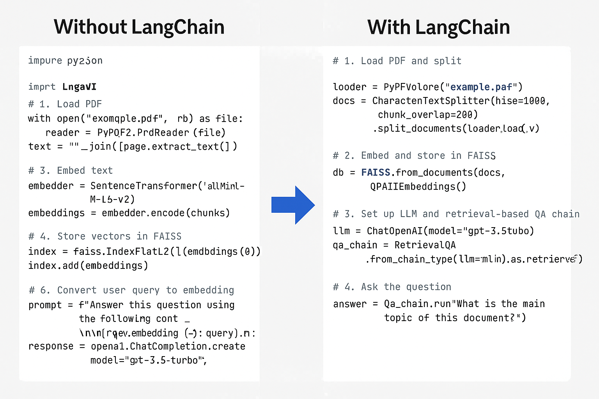

## 🧠 What is LangChain?

**LangChain** is a **Python framework** that helps you build powerful, intelligent applications using **Large Language Models (LLMs)** like ChatGPT.

It helps you connect the LLM to **external data** (PDFs, websites, databases, APIs), handle  **multi-step reasoning** , and **remember context** — things you can't do with just a basic API call.

---

## ❓ Why Do We Need LangChain?

Using a raw LLM is limited:

* It can't read your documents.
* It forgets context easily.
* It can't call APIs or tools.
* You have to build logic and memory handling from scratch.

👉 **LangChain solves this** by giving you tools to:

* Load and search your own data (PDFs, databases, etc.),
* Maintain memory of conversations,
* Use tools like APIs or calculators,
* Chain multiple steps together.

---

### How It Works (Step-by-Step)

1. **User asks a question** (e.g., “What’s my account balance?”).
2. Your **LangChain-powered app** does smart things like:
   * Use an **LLM** (e.g., ChatGPT) to understand the intent.
   * Decide whether to answer from:
     * The LLM’s built-in knowledge,
     * A **document/PDF/database** you provide,
     * Or by calling a **real API or tool** (like a weather API or internal system).
3. It  **retrieves the needed info** , formats it properly, and uses the LLM to generate a natural, friendly response.
4. **Returns the answer to the user** .

### 🧠 What Makes LangChain Special?

LangChain adds powerful features  **on top of language models** :

| Feature                | What It Does                                               |
| ---------------------- | ---------------------------------------------------------- |
| 📚 Knowledge Retrieval | Pull info from PDFs, websites, or vector DBs.              |
| 🧠 Memory              | Keep track of previous chats or session state.             |
| ⚙️ Tools & Agents    | Let the LLM**decide**when to call APIs/tools.        |
| 🔄 Chains              | Build complex workflows — step-by-step logic flows.<br /> |

## 🧱 Core Components of LangChain

| Component                 | What It Does                                                   |
| ------------------------- | -------------------------------------------------------------- |
| **LLM**             | Connects to a language model (e.g., GPT-4).                    |
| **Document Loader** | Reads data from files (PDFs, text, HTML).                      |
| **Text Splitter**   | Breaks long text into manageable pieces.                       |
| **Embeddings**      | Converts text to vector format for search.                     |
| **Vector Store**    | Stores vectors and lets you search by similarity.              |
| **Retriever**       | Finds relevant chunks of data to answer a query.               |
| **Chains**          | Connects components into workflows (e.g., Q&A, summarization). |
| **Agents & Tools**  | Let LLMs use tools (API calls, code execution).                |
| **Memory**          | Remembers previous chat history or facts.                      |

| Component                      | Role                                                                      | In Your Code                               |
| ------------------------------ | ------------------------------------------------------------------------- | ------------------------------------------ |
| **LLM (Language Model)** | The engine that generates responses (e.g., GPT-3.5, GPT-4).               | `ChatOpenAI(model="gpt-3.5-turbo")`      |
| **Document Loader**      | Loads content from sources like PDFs, websites, etc.                      | `PyPDFLoader("example.pdf")`             |
| **Text Splitter**        | Breaks large documents into smaller chunks for better processing.         | `CharacterTextSplitter(...)`             |
| **Embeddings**           | Turns chunks into vectors so they can be searched.                        | `OpenAIEmbeddings()`                     |
| **Vector Store**         | Stores the vectors and supports similarity search (like a search engine). | `FAISS.from_documents(...)`              |
| **Retriever**            | Interface to search for relevant chunks based on a user query.            | `retriever = vectorstore.as_retriever()` |
| **Chain**                | A combination of steps: retrieve + pass to LLM + format result.           | `RetrievalQA.from_chain_type(...)`       |

---

## 💼 Real-Life Example: PDF Q&A App (Like for a Lawyer or Doctor)

### Scenario:

You're building a chatbot for a  **law firm** . They have hundreds of PDF case files and want to ask questions like:

> "What was the final judgment in the 2019 Smith case?"

### Without LangChain:

* You'd manually load PDFs,
* Chunk and vectorize text,
* Write a custom search and response generator.

😓 It's a lot of work.

---

### ✅ With LangChain: It's Simple!

Here’s a minimal working example:

```python
from langchain.chat_models import ChatOpenAI
from langchain.chains import RetrievalQA
from langchain.vectorstores import FAISS
from langchain.embeddings import OpenAIEmbeddings
from langchain.document_loaders import PyPDFLoader
from langchain.text_splitter import CharacterTextSplitter

# 1. Load and split the PDF
loader = PyPDFLoader("case_file.pdf")
pages = loader.load()
splitter = CharacterTextSplitter(chunk_size=1000, chunk_overlap=200)
docs = splitter.split_documents(pages)

# 2. Embed and store in a vector DB
embeddings = OpenAIEmbeddings()
vectorstore = FAISS.from_documents(docs, embeddings)
retriever = vectorstore.as_retriever()

# 3. Set up the LLM and chain
llm = ChatOpenAI(model="gpt-3.5-turbo")
qa_chain = RetrievalQA.from_chain_type(llm=llm, retriever=retriever)

# 4. Ask a question
query = "What was the final judgment in the 2019 Smith case?"
answer = qa_chain.run(query)
print("Answer:", answer)
```

🎉 Done! You’ve built a smart assistant that can **understand, search, and answer questions from legal PDFs.**

---

## 🚀 Summary

| Item                         | Description                                                                 |
| ---------------------------- | --------------------------------------------------------------------------- |
| **What is LangChain?** | A toolkit to build smart apps powered by LLMs.                              |
| **Why use it?**        | To easily connect LLMs to your data, tools, memory, and logic.              |
| **What can it do?**    | Chatbots, search tools, assistants, API agents, document Q&A, and more.     |
| **Who uses it?**       | Developers building apps in finance, law, education, customer service, etc. |

---

Let me know if you'd like:

* A visual diagram of this,
* A Streamlit UI version,
* Or help using **free** LLMs or embeddings (e.g., Hugging Face).

Great question — let's clear this up 🔍

---

## 🤖 Can LLMs Call APIs, Access Databases, or Use Memory Without LangChain?

### ✅ Technically  **Yes** , but...

You **can** build all of that  **without LangChain** , but it means  **you must do everything manually** :

---

### 🛠️ Without LangChain (Manual Work)

To do things like:

| Feature                                     | What You Must Do Yourself                                                                     |
| ------------------------------------------- | --------------------------------------------------------------------------------------------- |
| **Call APIs**                         | Parse user intent, write code to call API, format response, reintegrate it with LLM prompt.   |
| **Query Databases**                   | Translate natural language to SQL, execute safely, handle responses, prevent SQL injection.   |
| **Memory (context)**                  | Build your own context manager to track previous inputs/outputs and insert into every prompt. |
| **Knowledge from files (e.g., PDFs)** | Write your own PDF loader, splitter, embedder, vector search, etc.                            |

It works — but it's  **complex, repetitive, and error-prone** .

---

### ✅ With LangChain

LangChain gives you **ready-made components** for:

| Task          | LangChain Component                                            |
| ------------- | -------------------------------------------------------------- |
| File loading  | `DocumentLoaders`(PDF, Notion, HTML, etc.)                   |
| Text chunking | `TextSplitter`                                               |
| Vector search | `Retriever`,`VectorStores`like FAISS, Chroma               |
| API tools     | `Agents + Tools`system                                       |
| Memory        | `ConversationBufferMemory`, etc.                             |
| LLM chaining  | `Chains`(e.g.,`RetrievalQA`,`ConversationalRetrievalQA`) |

👉 So instead of reinventing the wheel, you just  **plug things together** .

---

## 🧠 Summary

| Question                                           | Answer                                                                                 |
| -------------------------------------------------- | -------------------------------------------------------------------------------------- |
| Can LLMs access APIs/dbs/memory without LangChain? | ✅ Yes —**but you have to build it all yourself** .                             |
| Why use LangChain?                                 | It gives you**prebuilt, pluggable components**to do all that easily and cleanly. |

LangChain = like **Django for LLMs** — you *could* write raw Python web apps, but why not use a framework?

---

Would you like a side-by-side code comparison (with vs without LangChain)?


