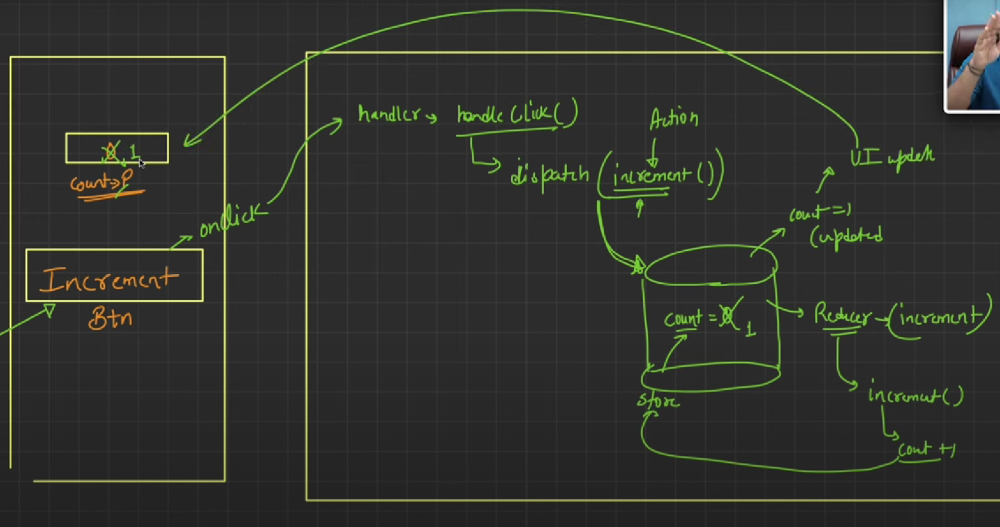

## 📌 **What is React?**

React is a **JavaScript library** for building **fast, interactive, and reusable** user interfaces. It is developed and maintained by **Meta (Facebook)** and follows a **component-based** architecture.

### 🛠 **Key Features of React**

1. **Component-Based Architecture** 🏗️
   * The UI is broken into **small, reusable** components.
   * Example: A navigation bar, button, or form in an app is a  **separate component** .
2. **Virtual DOM** ⚡
   * React creates a **lightweight copy** of the DOM called the  **Virtual DOM** .
   * Instead of updating the entire UI, React **compares differences** and updates only the necessary parts.
3. **One-Way Data Binding** 🔀
   * Data flows from **parent to child** via  **props** .
   * Makes debugging easier and ensures  **predictable UI updates** .
4. **Declarative UI** 🎨
   * You describe what the UI should look like, and React efficiently updates it.
   * Example: Instead of manually handling `document.createElement`, we **declare** the UI using JSX.
5. **Hooks (Functional Programming)** ⚓
   * `useState`, `useEffect`, `useContext`, etc., allow functional components to manage state and side effects.
6. **Server-Side Rendering (SSR) & Static Site Generation (SSG)** 🚀
   * With  **Next.js** , React apps can **pre-render** content for better SEO and performance.
7. **React Native (Mobile Development)** 📱
   * React can also be used to build **iOS and Android apps** using  **React Native** .

---

## 🏡 **Real-Life Example: React in an E-Commerce Website**

Imagine you're building **Amazon's product page** in React. Here's how React makes development easier:

### 🔹 **Component-Based Architecture**

Each section of the page is a  **separate reusable component** :

1. **Navbar Component** → Contains logo, search bar, and cart icon.
2. **Product Card Component** → Shows product image, name, price, and "Add to Cart" button.
3. **Cart Component** → Displays added items and total price.

```jsx
// ProductCard.js - A reusable component
function ProductCard({ product }) {
    return (
        <div className="product-card">
            
            <h3>{product.name}</h3>
            <p>${product.price}</p>
            <button onClick={() => addToCart(product)}>Add to Cart</button>
        </div>
    );
}
```

---

### 🔹 **Virtual DOM for Performance Optimization**

Without React:

* Clicking "Add to Cart" updates the total price, but the  **entire page reloads** .

With React:

* Virtual DOM  **only updates the cart section** , improving speed.

```jsx
// Cart.js - React updates only the necessary part
function Cart({ cartItems }) {
    return (
        <div className="cart">
            <h2>Cart Items</h2>
            {cartItems.map(item => <p>{item.name} - ${item.price}</p>)}
        </div>
    );
}
```

---

### 🔹 **State Management using Hooks**

Using the `useState` hook, we manage the shopping cart  **without reloading the page** .

```jsx
import { useState } from 'react';

function Shop() {
    const [cart, setCart] = useState([]);

    function addToCart(product) {
        setCart([...cart, product]); // Updates state
    }

    return (
        <div>
            <ProductCard product={{ name: "Laptop", price: 999, image: "laptop.jpg" }} addToCart={addToCart} />
            <Cart cartItems={cart} />
        </div>
    );
}
```

---

## 🎯 **Why Use React? (Interview Perspective)**

| Feature              | React Advantage                                       |
| -------------------- | ----------------------------------------------------- |
| Performance          | Virtual DOM speeds up rendering                       |
| Reusability          | Components can be reused across the app               |
| Scalability          | Large apps are manageable with component structure    |
| SEO Optimization     | Next.js helps with server-side rendering              |
| Mobile Compatibility | React Native allows cross-platform mobile development |

## 📌 **React.js Functionality & Key Components**

React.js is built on **components, state management, and hooks** to create dynamic, interactive UIs efficiently. Below is a breakdown of its key functionalities and components.

---

# 🚀 **1. React.js Core Functionalities**

### 🔹 **1.1 Component-Based Architecture** 🏗️

* Everything in React is a **component** (Navbar, Button, Card, etc.).
* Components can be **reused** to build complex UIs.

### 🔹 **1.2 Virtual DOM & Reconciliation** ⚡

* React  **does not modify the real DOM directly** . Instead, it updates the **Virtual DOM** and applies only the necessary changes.
* **Result:** Faster rendering and better performance.

### 🔹 **1.3 JSX (JavaScript XML)** 🔤

* JSX allows writing  **HTML inside JavaScript** .
* Example:
  ```jsx
  const element = <h1>Hello, React!</h1>;
  ```
* JSX gets **compiled into regular JavaScript** using Babel.

### 🔹 **1.4 One-Way Data Binding** 🔗

* Data flows **only from parent to child** via  **props** .
* Prevents **unexpected mutations** and makes debugging easier.

### 🔹 **1.5 React Hooks (Functional Components Only)** ⚓

* Hooks allow functional components to  **use state and lifecycle methods** .
* Common hooks:
  * `useState` → Manage state
  * `useEffect` → Handle side effects
  * `useContext` → Share state without props

---

# 🏗️ **2. React Components**

## 🔹 **2.1 Types of Components**

### ✅ **1. Functional Components (Modern Approach)**

* **Simple JavaScript functions** that return JSX.
* **No `this` keyword** , uses **hooks** for state.

Example:

```jsx
function Greeting(props) {
    return <h1>Hello, {props.name}!</h1>;
}
```

### ✅ **2. Class Components (Older Approach)**

* Uses `class` syntax and `this.state`.
* Not recommended in new projects.

Example:

```jsx
class Greeting extends React.Component {
    render() {
        return <h1>Hello, {this.props.name}!</h1>;
    }
}
```

---

## 🔹 **2.2 Functional Component with Hooks**

```jsx
import React, { useState } from 'react';

function Counter() {
    const [count, setCount] = useState(0);

    return (
        <div>
            <p>Count: {count}</p>
            <button onClick={() => setCount(count + 1)}>Increment</button>
        </div>
    );
}
```

* `useState(0)` initializes `count` as `0`.
* `setCount(count + 1)` updates the state.

---

# 🔥 **3. React.js Key Features & Components**

| Feature                          | Description                                    | Example                                                     |
| -------------------------------- | ---------------------------------------------- | ----------------------------------------------------------- |
| **Props**                  | Pass data from parent to child                 | `<ChildComponent name="John" />`                          |
| **State**                  | Stores local component data                    | `useState(0)`                                             |
| **Lifecycle Methods**      | Control component behavior at different stages | `useEffect(() => {}, [])`                                 |
| **Event Handling**         | Handling user interactions                     | `onClick={handleClick}`                                   |
| **Conditional Rendering**  | Render UI based on conditions                  | `{isLoggedIn ? <Dashboard /> : <Login />}`                |
| **Lists & Keys**           | Rendering lists dynamically                    | `{items.map(item => <li key={item.id}>{item.name}</li>)}` |
| **Context API**            | Manage global state without props              | `useContext(MyContext)`                                   |
| **Routing (React Router)** | Navigation between pages                       | `<Route path="/home" element={<Home />} />`               |

---

# ⚡ **5. State Management in React**

## 🔹 **5.1 Local State (`useState`)**

* Stores state  **inside a component** .
* Example:
  ```jsx
  const [count, setCount] = useState(0);
  ```

# 🌍 **6. React Router (Navigation in React)**

* **React Router** allows page navigation  **without reloading the page** .
* Example:
  ```jsx
  import { BrowserRouter, Route, Routes } from 'react-router-dom';

  function App() {
      return (
          <BrowserRouter>
              <Routes>
                  <Route path="/" element={<Home />} />
                  <Route path="/about" element={<About />} />
              </Routes>
          </BrowserRouter>
      );
  }
  ```

---

# 🔥 **7. Advanced Topics**

### **formance Optimization**

* **Lazy Loading** : `React.lazy()` loads components  **only when needed** .
* **Memoization** :
* `useMemo()` → Caches computed values.
* `useCallback()` → Caches functions.

Example:

```jsx
const expensiveCalculation = useMemo(() => computeExpensiveValue(data), [data]);
```

---

# 🎯 **Final Summary**

| Concept                 | Explanation                                               |
| ----------------------- | --------------------------------------------------------- |
| **Components**    | Reusable UI building blocks                               |
| **JSX**           | HTML inside JavaScript                                    |
| **Props**         | Pass data to child components                             |
| **State**         | Manage dynamic data in components                         |
| **Hooks**         | Enable state & lifecycle methods in functional components |
| **Context API**   | Manage global state without prop drilling                 |
| **React Router**  | Handles navigation in React apps                          |
| **SSR (Next.js)** | Pre-renders pages for better SEO                          |
| **Performance**   | Optimized with Virtual DOM, lazy loading, and memoization |

---

# Form Handling in react


---

---

### **📌 What is Redux?**

Redux is a **state management library** for JavaScript applications, mainly used with React. It helps **manage and share state** across multiple components efficiently.

---

## **🚀 Why do we need Redux?**

### **💡 The Problem: State Management in Large Applications**

In React, each component **manages its own state** using `useState` or `useContext`.

🔴 But as an app grows:

* **Data needs to be shared across multiple components** (prop drilling issue).
* **State updates can become complex** and hard to track.
* **Debugging becomes difficult** when multiple components modify the same state.

✅ **Redux solves this by providing a central store** where all components can access and update the state  **in a structured way** .

---

## **📌 Key Terminologies in Redux**

### **1️⃣ Store (Global State Container)**

The **store is a big object that holds the entire state** of the application.

* Instead of keeping state in individual components, Redux  **stores all data centrally** .
* Any component can **access or modify the store** without passing props.

📌 **Example:**

Imagine a **shopping cart** in an  **e-commerce website** .

* The **cart data (items, total price, etc.)** is stored in Redux.
* The cart icon in the navbar, the checkout page, and the product list **all access the same store** to show the updated cart details.

---

### **2️⃣ Action (Event that Triggers a Change)**

Actions are **plain objects that describe what should happen** in the app.

* An action tells Redux **what needs to change** in the store.
* Actions are sent using a function called  **dispatch** .

📌 **Example:**

* **"Add item to cart"** action is triggered when a user clicks "Add to Cart".
* **"Remove item from cart"** action is triggered when a user removes an item.

---

### **3️⃣ Reducer (Decides How the State Changes)**

Reducers are  **functions that take the current state and an action, then return a new state** .

* They **decide how to update the store** based on the action received.
* They **do not modify the existing state** but return a  **new updated state** .

📌 **Example:**

* When the "Add to Cart" action is received, the reducer **adds the item to the cart list** in the store.
* When the "Remove from Cart" action is received, the reducer **removes the item** from the cart.

---

### **4️⃣ State (Current Data in the Store)**

State refers to the  **current snapshot of data stored in Redux** .

* Whenever an action is dispatched, the state **gets updated by reducers** and the changes  **reflect in the UI** .

📌 **Example:**

* If the user has 3 items in the cart, the  **Redux store holds that data** .
* When a new item is added, Redux  **updates the state** , and the new item appears in the cart.

---

### **5️⃣ Slice (Managing State in a Modular Way)**

A **slice** is a way to **organize Redux state** into separate parts for different features.

* Each  **slice contains its own state, actions, and reducers** .
* It helps in  **keeping Redux code organized** .

📌 **Example:**

In an  **e-commerce app** , we can have different slices:

* **Cart slice** (handles cart items, total amount, etc.)
* **User slice** (handles login, logout, user details)
* **Product slice** (manages product list, filters, etc.)

---

## **📌 How Everything Works Together in Redux**

### **🎯 Example: Adding a Product to Cart in an E-commerce Website**

1. **User clicks "Add to Cart" button** → An **action** (`ADD_TO_CART`) is created.
2. **Redux dispatches the action** → Sends it to the  **reducer** .
3. **Reducer updates the state** → Adds the item to the cart in the  **store** .
4. **State is updated in Redux** → The UI updates automatically across all components.

---

## **📌 Summary of Redux**

* **Redux provides a single global store** to manage application state efficiently.
* It **eliminates prop drilling** and makes  **state updates predictable** .
* **Actions describe what happens, reducers decide how the state changes, and the store holds the state** .
* **Slices help in organizing the Redux state** for better management.

🚀 **Redux is like a central hub that keeps track of all changes in your application’s state, making data management easier and more predictable!**

**🚀 Conclusion**

* **useState** : Best for **local state** inside a component.
* **useContext** : Good for **sharing state between components** without passing props.
* **Redux** : Best for **managing complex, global state** across the entire app.

💡 **Think of it like this:**

* `useState` → Keeping notes on a sticky pad for yourself.
* `useContext` → Sharing notes with your team in a small WhatsApp group.
* `Redux` → Using a shared Google Doc for an entire company to update data.




Here's a **simple Redux counter app** that has a `count` state and two actions: **increment** and  **decrement** .

---

### **1️⃣ Install Redux and React-Redux**

If you haven't installed Redux yet, run:

```bash
npm install @reduxjs/toolkit react-redux
```

---

### **2️⃣ Setup Redux Store**

📌 We create a Redux store, a reducer, and actions to manage the `count` state.

#### **`store.js` (Redux Store Setup)**

```jsx
import { configureStore, createSlice } from "@reduxjs/toolkit";

// 1️⃣ Create a slice (state + reducers)
const counterSlice = createSlice({
  name: "counter",
  initialState: { count: 0 },
  reducers: {
    increment: (state) => {
      state.count += 1;
    },
    decrement: (state) => {
      state.count -= 1;
    },
  },
});

// 2️⃣ Export actions
export const { increment, decrement } = counterSlice.actions;

// 3️⃣ Create and export store
const store = configureStore({
  reducer: {
    counter: counterSlice.reducer,
  },
});

export default store;
```

---

### **3️⃣ Provide the Store to the App**

📌 We use `Provider` from `react-redux` to make the Redux store available to all components.

#### **`index.js` (Wrap App with Provider)**

```jsx
import React from "react";
import ReactDOM from "react-dom";
import { Provider } from "react-redux";
import store from "./store";
import App from "./App";

ReactDOM.render(
  <Provider store={store}>
    <App />
  </Provider>,
  document.getElementById("root")
);
```

---

### **4️⃣ Create the Counter Component**

📌 Now, let's create the **Counter** component where we **read the count value** and **dispatch actions** for incrementing and decrementing.

#### **`Counter.js` (Counter Component)**

```jsx
import React from "react";
import { useDispatch, useSelector } from "react-redux";
import { increment, decrement } from "./store";

const Counter = () => {
  // 1️⃣ Get count from Redux store
  const count = useSelector((state) => state.counter.count);

  // 2️⃣ Get dispatch function to send actions
  const dispatch = useDispatch();

  return (
    <div style={{ textAlign: "center", marginTop: "50px" }}>
      <h2>Redux Counter</h2>
      <h1>{count}</h1>
      <button onClick={() => dispatch(increment())}>Increment</button>
      <button onClick={() => dispatch(decrement())} style={{ marginLeft: "10px" }}>
        Decrement
      </button>
    </div>
  );
};

export default Counter;
```

---

### **5️⃣ Use the Counter Component in App**

📌 Finally, we use our `Counter` component inside `App.js`.

#### **`App.js`**

```jsx
import React from "react";
import Counter from "./Counter";

const App = () => {
  return (
    <div>
      <Counter />
    </div>
  );
};

export default App;
```

---

### **🎯 How This Works**

✅ The Redux store holds a `count` state.

✅ `Counter.js` **reads** the `count` value using `useSelector()`.

✅ When the **increment** or **decrement** button is clicked, `dispatch()` sends an action (`increment()` or `decrement()`).

✅ The  **store updates the state** , and the UI **automatically re-renders** with the new count value.

---

### **🚀 Summary**

| **Step**            | **What We Did**                                         |
| ------------------------- | ------------------------------------------------------------- |
| 1️⃣ Create Store        | Used `createSlice()`to define state and reducers            |
| 2️⃣ Wrap App with Store | Used `<Provider store={store}>`in `index.js`              |
| 3️⃣ Access State        | Used `useSelector()`in `Counter.js`to get count           |
| 4️⃣ Dispatch Actions    | Used `useDispatch()`to call `increment()`&`decrement()` |

---

🔥 **That's it! Now you have a fully working Redux counter app!** 🚀

Would you like me to add **Redux Persist** to store the count even after a page refresh? 😊
