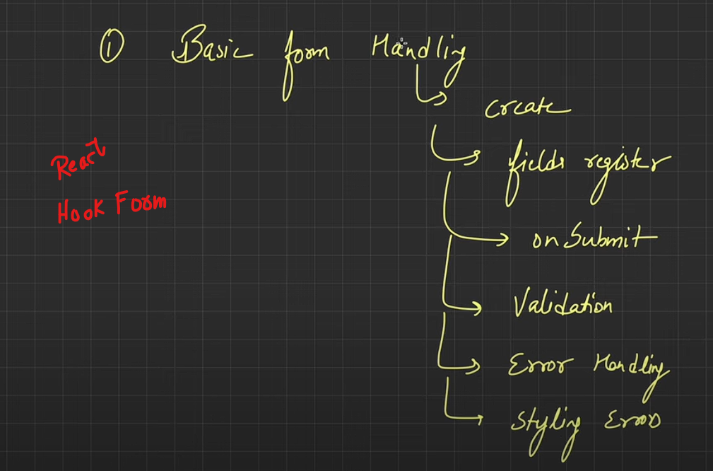
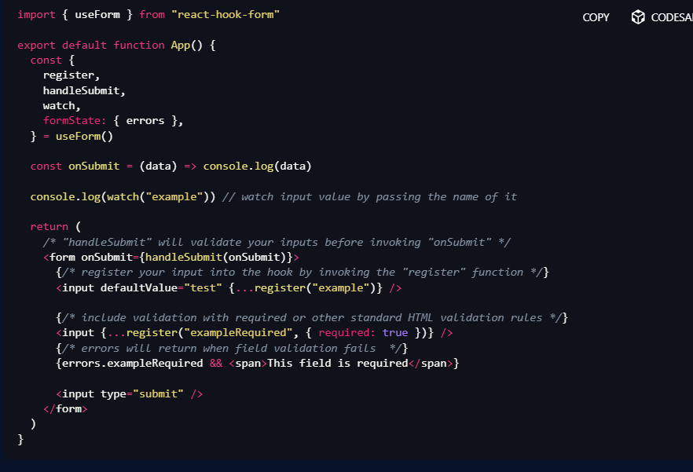
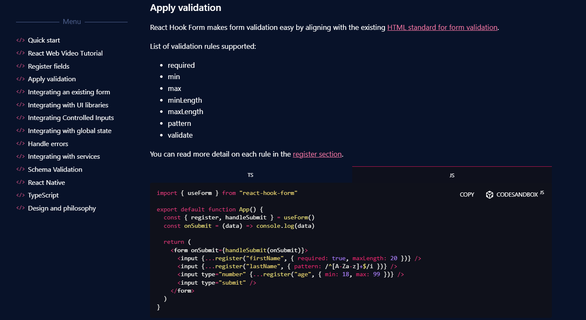

## 📌 **What is React?**

React is a **JavaScript library** for building **fast, interactive, and reusable** user interfaces. It is developed and maintained by **Meta (Facebook)** and follows a **component-based** architecture.

### 🛠 **Key Features of React**

1. **Component-Based Architecture** 🏗️
   * The UI is broken into **small, reusable** components.
   * Example: A navigation bar, button, or form in an app is a  **separate component** .
2. **Virtual DOM** ⚡
   * React creates a **lightweight copy** of the DOM called the  **Virtual DOM** .
   * Instead of updating the entire UI, React **compares differences** and updates only the necessary parts.
3. **One-Way Data Binding** 🔀
   * Data flows from **parent to child** via  **props** .
   * Makes debugging easier and ensures  **predictable UI updates** .
4. **Declarative UI** 🎨
   * You describe what the UI should look like, and React efficiently updates it.
   * Example: Instead of manually handling `document.createElement`, we **declare** the UI using JSX.
5. **Hooks (Functional Programming)** ⚓
   * `useState`, `useEffect`, `useContext`, etc., allow functional components to manage state and side effects.
6. **Server-Side Rendering (SSR) & Static Site Generation (SSG)** 🚀
   * With  **Next.js** , React apps can **pre-render** content for better SEO and performance.
7. **React Native (Mobile Development)** 📱
   * React can also be used to build **iOS and Android apps** using  **React Native** .

---

## 🏡 **Real-Life Example: React in an E-Commerce Website**

Imagine you're building **Amazon's product page** in React. Here's how React makes development easier:

### 🔹 **Component-Based Architecture**

Each section of the page is a  **separate reusable component** :

1. **Navbar Component** → Contains logo, search bar, and cart icon.
2. **Product Card Component** → Shows product image, name, price, and "Add to Cart" button.
3. **Cart Component** → Displays added items and total price.

```jsx
// ProductCard.js - A reusable component
function ProductCard({ product }) {
    return (
        <div className="product-card">
            
            <h3>{product.name}</h3>
            <p>${product.price}</p>
            <button onClick={() => addToCart(product)}>Add to Cart</button>
        </div>
    );
}
```

---

### 🔹 **Virtual DOM for Performance Optimization**

Without React:

* Clicking "Add to Cart" updates the total price, but the  **entire page reloads** .

With React:

* Virtual DOM  **only updates the cart section** , improving speed.

```jsx
// Cart.js - React updates only the necessary part
function Cart({ cartItems }) {
    return (
        <div className="cart">
            <h2>Cart Items</h2>
            {cartItems.map(item => <p>{item.name} - ${item.price}</p>)}
        </div>
    );
}
```

---

### 🔹 **State Management using Hooks**

Using the `useState` hook, we manage the shopping cart  **without reloading the page** .

```jsx
import { useState } from 'react';

function Shop() {
    const [cart, setCart] = useState([]);

    function addToCart(product) {
        setCart([...cart, product]); // Updates state
    }

    return (
        <div>
            <ProductCard product={{ name: "Laptop", price: 999, image: "laptop.jpg" }} addToCart={addToCart} />
            <Cart cartItems={cart} />
        </div>
    );
}
```

---

## 🎯 **Why Use React? (Interview Perspective)**

| Feature              | React Advantage                                       |
| -------------------- | ----------------------------------------------------- |
| Performance          | Virtual DOM speeds up rendering                       |
| Reusability          | Components can be reused across the app               |
| Scalability          | Large apps are manageable with component structure    |
| SEO Optimization     | Next.js helps with server-side rendering              |
| Mobile Compatibility | React Native allows cross-platform mobile development |

## 📌 **React.js Functionality & Key Components**

React.js is built on **components, state management, and hooks** to create dynamic, interactive UIs efficiently. Below is a breakdown of its key functionalities and components.

---

# 🚀 **1. React.js Core Functionalities**

### 🔹 **1.1 Component-Based Architecture** 🏗️

* Everything in React is a **component** (Navbar, Button, Card, etc.).
* Components can be **reused** to build complex UIs.

### 🔹 **1.2 Virtual DOM & Reconciliation** ⚡

* React  **does not modify the real DOM directly** . Instead, it updates the **Virtual DOM** and applies only the necessary changes.
* **Result:** Faster rendering and better performance.

### 🔹 **1.3 JSX (JavaScript XML)** 🔤

* JSX allows writing  **HTML inside JavaScript** .
* Example:
  ```jsx
  const element = <h1>Hello, React!</h1>;
  ```
* JSX gets **compiled into regular JavaScript** using Babel.

### 🔹 **1.4 One-Way Data Binding** 🔗

* Data flows **only from parent to child** via  **props** .
* Prevents **unexpected mutations** and makes debugging easier.

### 🔹 **1.5 React Hooks (Functional Components Only)** ⚓

* Hooks allow functional components to  **use state and lifecycle methods** .
* Common hooks:
  * `useState` → Manage state
  * `useEffect` → Handle side effects
  * `useContext` → Share state without props

---

# 🏗️ **2. React Components**

## 🔹 **2.1 Types of Components**

### ✅ **1. Functional Components (Modern Approach)**

* **Simple JavaScript functions** that return JSX.
* **No `this` keyword** , uses **hooks** for state.

Example:

```jsx
function Greeting(props) {
    return <h1>Hello, {props.name}!</h1>;
}
```

### ✅ **2. Class Components (Older Approach)**

* Uses `class` syntax and `this.state`.
* Not recommended in new projects.

Example:

```jsx
class Greeting extends React.Component {
    render() {
        return <h1>Hello, {this.props.name}!</h1>;
    }
}
```

---

## 🔹 **2.2 Functional Component with Hooks**

```jsx
import React, { useState } from 'react';

function Counter() {
    const [count, setCount] = useState(0);

    return (
        <div>
            <p>Count: {count}</p>
            <button onClick={() => setCount(count + 1)}>Increment</button>
        </div>
    );
}
```

* `useState(0)` initializes `count` as `0`.
* `setCount(count + 1)` updates the state.

---

# 🔥 **3. React.js Key Features & Components**

| Feature                          | Description                                    | Example                                                     |
| -------------------------------- | ---------------------------------------------- | ----------------------------------------------------------- |
| **Props**                  | Pass data from parent to child                 | `<ChildComponent name="John" />`                          |
| **State**                  | Stores local component data                    | `useState(0)`                                             |
| **Lifecycle Methods**      | Control component behavior at different stages | `useEffect(() => {}, [])`                                 |
| **Event Handling**         | Handling user interactions                     | `onClick={handleClick}`                                   |
| **Conditional Rendering**  | Render UI based on conditions                  | `{isLoggedIn ? <Dashboard /> : <Login />}`                |
| **Lists & Keys**           | Rendering lists dynamically                    | `{items.map(item => <li key={item.id}>{item.name}</li>)}` |
| **Context API**            | Manage global state without props              | `useContext(MyContext)`                                   |
| **Routing (React Router)** | Navigation between pages                       | `<Route path="/home" element={<Home />} />`               |

---

# ⚡ **5. State Management in React**

## 🔹 **5.1 Local State (`useState`)**

* Stores state  **inside a component** .
* Example:
  ```jsx
  const [count, setCount] = useState(0);
  ```

# 🌍 **6. React Router (Navigation in React)**

* **React Router** allows page navigation  **without reloading the page** .
* Example:
  ```jsx
  import { BrowserRouter, Route, Routes } from 'react-router-dom';

  function App() {
      return (
          <BrowserRouter>
              <Routes>
                  <Route path="/" element={<Home />} />
                  <Route path="/about" element={<About />} />
              </Routes>
          </BrowserRouter>
      );
  }
  ```

---

# 🔥 **7. Advanced Topics**

### **formance Optimization**

* **Lazy Loading** : `React.lazy()` loads components  **only when needed** .
* **Memoization** :
* `useMemo()` → Caches computed values.
* `useCallback()` → Caches functions.

Example:

```jsx
const expensiveCalculation = useMemo(() => computeExpensiveValue(data), [data]);
```

---

# 🎯 **Final Summary**

| Concept                 | Explanation                                               |
| ----------------------- | --------------------------------------------------------- |
| **Components**    | Reusable UI building blocks                               |
| **JSX**           | HTML inside JavaScript                                    |
| **Props**         | Pass data to child components                             |
| **State**         | Manage dynamic data in components                         |
| **Hooks**         | Enable state & lifecycle methods in functional components |
| **Context API**   | Manage global state without prop drilling                 |
| **React Router**  | Handles navigation in React apps                          |
| **SSR (Next.js)** | Pre-renders pages for better SEO                          |
| **Performance**   | Optimized with Virtual DOM, lazy loading, and memoization |

---


# Form Handling in react







